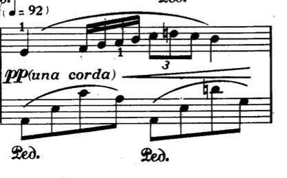
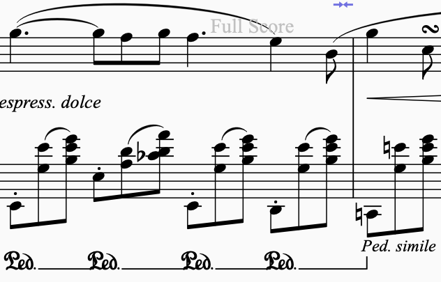
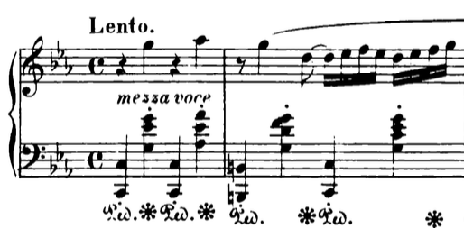
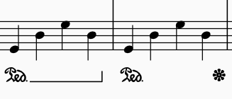
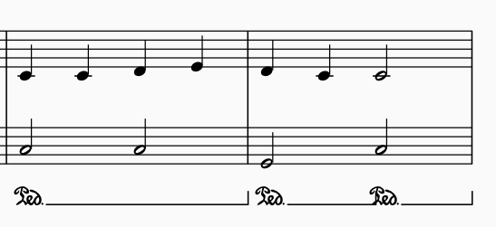

# How Pedal Usage is Marked in Sheet Music

In this lesson we're going to talk about how the Una Corda and the Sustain pedal is marked in sheet music. (The Sostenuto pedal or middle pedal is used so infrequently that it's hard to find sheet music that even depicts this pedal marking).

* * *

### Una Corda Pedal (the left pedal)

The above sheet music is from Chopin's Nocturne in C# Minor. Notice how the "una corda" marking is put in between the 2 staves - that's typically where it will be marked.

Generally, if a piece is marked "pp" (for pianissimo, or extremely extremely quiet), you can use the left pedal. Note that we haven't yet covered dynamics yet, so just keep in mind that una corda can be used whenever the piece calls for a "very quiet" feeling.

* * *

### The Sustain / Damper Pedal

The above sheet music is from Chopin's Nocturne in Eb Major. The pedal markings go "Ped\_\_\_\_\_\_\_\_Ped\_\_\_\_\_\_\_\_" and basically the idea is that you should press the pedal when it says PED, and then for as long as the line goes, you should be holding the pedal.

Note that pedal markings can sometimes also look like this:

In the following case, the star symbol (\*) denotes the end of the pedal. So you press the pedal when it says "Ped" and then once you see the \* sign, you lift the pedal.

Both of these above pedal markings are valid markings, and depending on the composer, may be used in different situations. However, for now we will use the first variation, as it is more clear where the pedal mark begins and ends.

* * *

# How to read a (sustain) pedal marking

The way to read a sustain pedal marking is to see where the start and end of the marking is. For example, in the below 2 measures, we can see that for the first measure, the pedal marking lasts the whole measure, while in the 2nd measure, the pedal marking lasts only half the measure:

The key to remember is that when you pedal, you must "catch" the first note. This means that if you pedal after you already release the note, it's too late - the note's strings have already been dampered, and you must press the note again in order to get it to sound out.

Pedaling is something that comes with time - so don't worry about getting it perfect for now. Just focus on getting into the habit of pressing and releasing the pedal as dictated by the pedal markings on the sheet music.

### Download below the 1st Pedaling Exercise

<Pdf src="TODO_UPLOAD_pedaling-full-score.pdf" title="Pedaling - Full Score.pdf" />
{/* TODO: upload "Pedaling - Full Score.pdf" to /public or asset storage and replace src */}

## Lesson Summary

In sheet music, the usage of pedals is marked as follows:

-   **Una Corda Pedal (the left pedal):**
-   Example: Chopin's Nocturne in C# Minor
-   The "una corda" marking is placed between the 2 clefs.
-   Typically used when the piece is marked "pp" for pianissimo (very quiet).
-   **Sustain / Damper Pedal:**
-   Example: Chopin's Nocturne in Eb Major
-   Pedal markings are represented as "Ped\_\_\_\_\_\_\_\_Ped\_\_\_\_\_\_\_\_".
-   Press the pedal at "Ped" and hold it until the line ends. Alternatively, a \* symbol may denote the pedal release.

<Video playbackId="Pq9yYkJmqO" />
{/* TODO: re-upload "una corda pedal sheet music.mov" to Mux and replace playbackId */}

<Video playbackId="gL6Y4wQxqG" />
{/* TODO: re-upload "sustain pedal sheet music.mov" to Mux and replace playbackId */}
